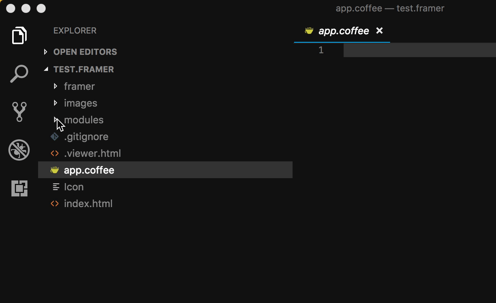
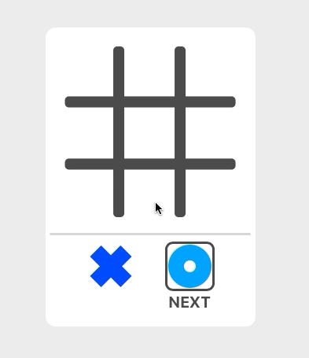

# Casing  - A UI framework for Framer 
### ✕ ⃝  

Casing will help you to manage:

* Components (modular pieces of UI)
* Screens (sets of components)
* Data (mutable and immutable information shown in the prototype)

It is system which supports building truly big and complex Framer prototypes using real data.

## ⃝ Installation

Copy over following files to your `PROJECT_NAME.framer/modules/` directory:

* `Casing.coffee` - REQUIRED. Contains the entirety of Casing's code
* `FrmrDatePicker.coffee` - if you want to use a date-picker in your prototype
* `FrmrDropdown.coffee` - if you want to use a drop-down in your prototype
* `FrmrTextInput.coffee` - if you want to use a text-input in your prototype

### 🔔 In large prototypes there is a one-to-one mapping with Frames in design mode and code modules. 

| ✕ ⃝ - **Modules** | **Description** |
| :---: | :--- |
|  | **If you're new to modules in Framer:**  <ul><li>Open the Framer directory using a text editor i.e. [Visual Studio Code](https://code.visualstudio.com/download)</li><li>The directory named 'modules' generated on Framer project creation will already contain an example `myModule.coffee` file.</li><li>The `Casing.coffee` file is required in this directory.</li> |

## ⃝ Getting Started

To be added soon...!

## ⃝ Examples

| ✕ ⃝ - **Example** | **Description** |
| :---: | :---: |
|  | `example-webapp.framer`  A non-linear multi-screen webapp built using Casing/Framer |
|  | `example-tictactoe.framer`   A Casing/Framer version of the popular [React Tutorial][react-tutorial] | 

[react-tutorial]: https://reactjs.org/tutorial/tutorial.html

## ⃝ Components

| ✕ ⃝ - **Component** | **Description** |
| :---: | :---: |
|  | `FrmrDatePicker.coffee`  📅 A highly customisable 'real' calendar component for Framer   Tutorial will be made available soon|
|  | `FrmrDropdown.coffee`   👇 A dropdown menu built with real data in mind.   Currently styled with inline CSS | 
|  | `FrmrTextInput.coffee`    💬 A customisable input box    Adapted from [Ajimix's input module](https://github.com/ajimix/Input-Framer)| 

## ⃝ FAQ
### How will Framer X impact Casing?
When Framer X is released, Casing ✕ will become open source soon after.   
This will likely require: 
<ul><li>Compiling coffeescript code into ES6</li><li>Updates to optimise the design tab workflow for Framer X</li><li>Releasing the components to the component store</li></ul>

The Casing Framework and its components will still be applicable for building **big & complex** prototypes in Framer X

## ⃝ Thank You

A warm thank you to Twitter and [Oliver Turner](https://twitter.com/oliverturner) for help with the name.  
Thank you from all of my heart to everyone at Framer for building such an awesome tool and a supportive [community](https://framer.com/community/)
