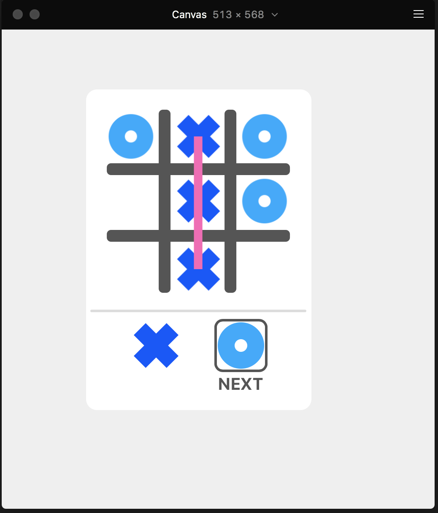
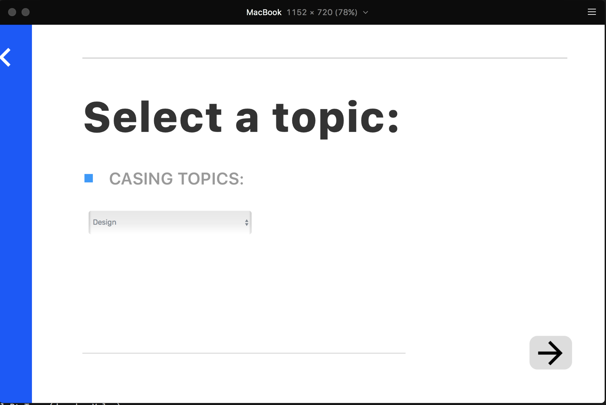

# Casing - UI framework for Framer

Casing is a framework for Framer which helps you with managing:

* components - modular pieces of UI
* screens - which are sets of components
* data - mutable and immutable information shown in prototype

# Installation

Copy over following files to your `PROJECT_NAME.framer/modules/` directory:

* `Casing.coffee` - REQUIRED. Contains the entirety of Casing's code
* `FrmrDatePicker.coffee` - if you want to use a date-picker in your prototype
* `FrmrDropdown.coffee` - if you want to use a drop-down in your prototype
* `FrmrTextInput.coffee` - if you want to use a text-input in your prototype

![Modules Example][modules_example]

If you're new to modules in Framer, the default directory named 'modules' generated on a Framer project creation will already contain a myModule.coffee file with instructions on how to get started. The Casing.coffee file is required in this directory.

# Getting Started

To be added soon...!

# Examples

To see an example of what Casing can do, clone the repository and open the below mentioned
subdirectories using Framer.

* `example-tictactoe.framer` - A Framer/Casing version of the popular [React Tutorial][react-tutorial]
{:height="50%" width="50%"}
* `example-webapp.framer` - example of a simple non-linear multi-screen webapp
{:height="50%" width="50%"}

[react-tutorial]: https://reactjs.org/tutorial/tutorial.html

# Thank You

A warm thank you to Twitter and Oliver Turner for help with the name!
